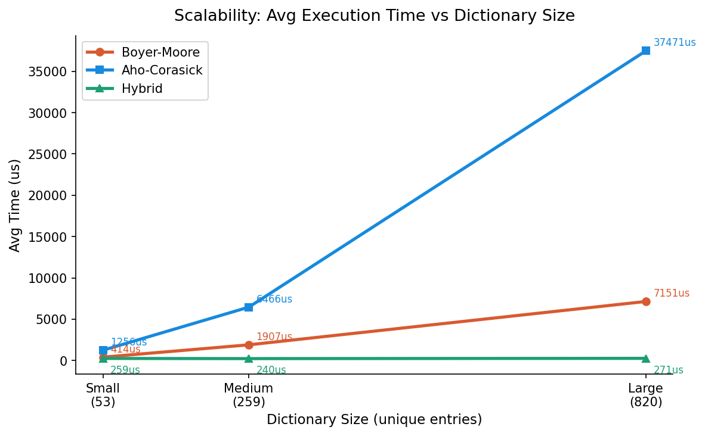
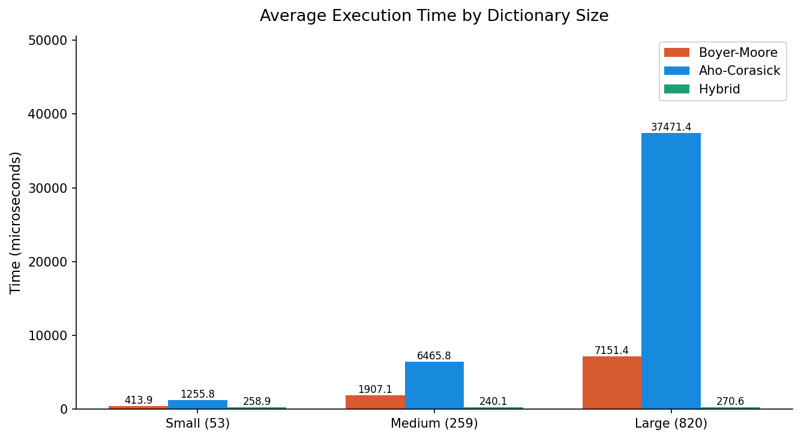
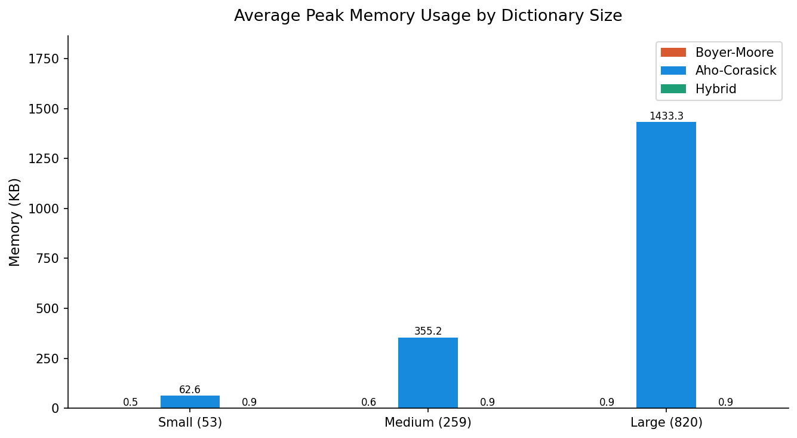
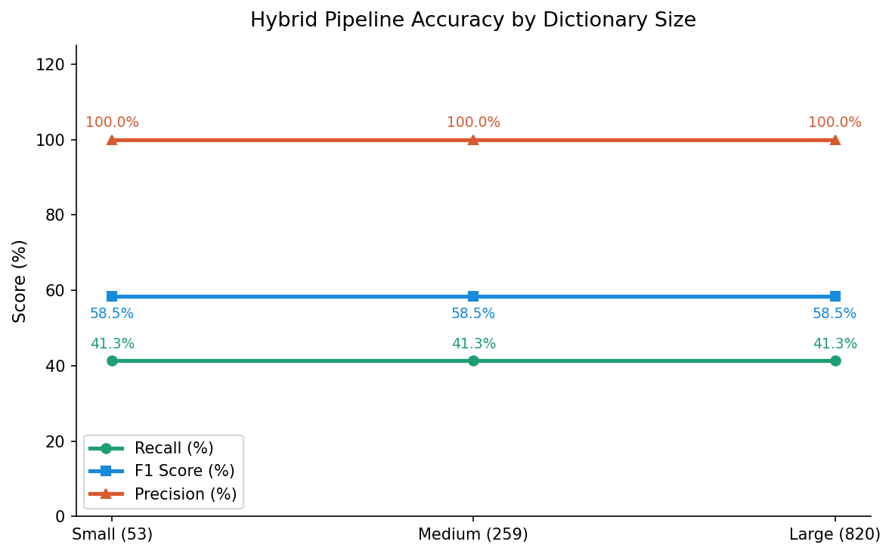
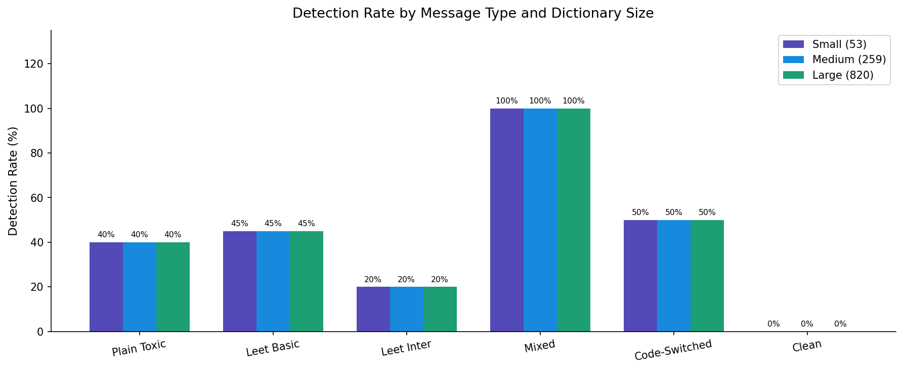

# 🎮 Leetspeak-Normalized Boyer-Moore & Aho-Corasick Hybrid Pipeline
### Toxic Language Detection for Online Game Chat

<p align="center">
  
</p>

<p align="center">
  
  
  
  
  
</p>

---

## 📋 Overview

This project implements a **three-stage hybrid pipeline** for real-time toxic language detection in online game chat environments — specifically targeting Filipino and English **Mobile Legends: Bang Bang** (MLBB) messages.

The pipeline addresses a core challenge in chat moderation: players routinely obfuscate toxic words using **leetspeak** (e.g., `g4g0`, `74ng1n4`, `b0b0`) to evade simple keyword filters. Our solution combines:

1. **Leetspeak Normalizer** — rule-based character substitution preprocessing
2. **Boyer-Moore** — fast single-pattern pre-screen on high-risk keywords (Stage 1)
3. **Aho-Corasick** — exhaustive multi-pattern dictionary scan (Stage 2, triggered only on high-risk hits)

The key innovation is the **early-exit architecture**: if Boyer-Moore finds no high-risk keyword, the pipeline terminates immediately — skipping the more expensive Aho-Corasick scan entirely. This decouples per-message latency from dictionary size.

---

## 🏗️ Pipeline Architecture

```
Raw Chat Message
      │
      ▼
┌─────────────────────────────┐
│  Stage 0: Leetspeak         │   g4g0  →  gago
│  Normalization              │   74ng4 →  tanga
│  (character substitution)   │   b0b0  →  bobo
└──────────────┬──────────────┘
               │ normalized text
               ▼
┌─────────────────────────────┐
│  Stage 1: Boyer-Moore       │   Scans for HIGH-RISK keywords only
│  Pre-Screen                 │   Uses bad-character + good-suffix heuristics
│                             │   Skips large text segments — sublinear O(n/m)
└──────────────┬──────────────┘
               │
       ┌───────┴────────┐
       │                │
   No match          Match found
       │                │
       ▼                ▼
  EARLY EXIT    ┌───────────────────────┐
  (clean msg)   │  Stage 2: Aho-Corasick│   Full dictionary scan
                │  Full Dictionary Scan │   Single linear pass O(n+z)
                │                       │   Trie pre-built at init
                └───────────┬───────────┘
                            │
                            ▼
                   Deduplicated matches
                   Structured JSON output
```

---

## 📊 Key Results

All experiments run on **90 labeled MLBB game chat messages** across three dictionary sizes (53 / 259 / 820 entries), 5 runs each, averaged.

### ⚡ Execution Time

| Algorithm     | Small (53) | Medium (259) | Large (820) |
|---------------|:----------:|:------------:|:-----------:|
| Boyer-Moore   | 414 µs     | 1,907 µs     | 7,151 µs    |
| Aho-Corasick  | 1,256 µs   | 6,466 µs     | 37,471 µs   |
| **Hybrid**    | **259 µs** | **240 µs**   | **271 µs**  |

> The hybrid pipeline's latency is **nearly constant** regardless of dictionary size — all well under the 5 ms real-time threshold.

### 🧠 Memory Usage

| Algorithm     | Small (53) | Medium (259) | Large (820) |
|---------------|:----------:|:------------:|:-----------:|
| Boyer-Moore   | 0.5 KB     | 0.6 KB       | 0.9 KB      |
| Aho-Corasick  | 62.6 KB    | 355.2 KB     | 1,433.3 KB  |
| **Hybrid**    | **0.9 KB** | **0.9 KB**   | **0.9 KB**  |

### 🎯 Accuracy (Hybrid Pipeline)

| Metric    | All Dictionary Sizes |
|-----------|:--------------------:|
| Precision | **100%**             |
| Recall    | 41.3%                |
| F1 Score  | 58.5%                |
| Specificity (Clean msgs) | **100%** |

> Zero false positives across all configurations. The recall ceiling is determined by the Boyer-Moore high-risk keyword subset — not the dictionary size.

### 📈 Detection by Message Type

| Message Type       | Detection Rate |
|--------------------|:--------------:|
| Plain Toxic        | 40%            |
| Basic Leetspeak    | 45%            |
| Intermediate Leet  | 20%            |
| Mixed              | **100%**       |
| Code-Switched      | 50%            |
| Clean (specificity)| **100%**       |

---

## 🗂️ Project Structure

```
hybrid_pipeline-main/
│
├── __init__.py               ← Public API exports
├── normalizer.py             ← Stage 0: Leetspeak normalizer
├── boyer_moore.py            ← Stage 1: Boyer-Moore algorithm + HIGH_RISK_KEYWORDS
├── aho_corasick.py           ← Stage 2: Aho-Corasick trie automaton
├── hybrid.py                 ← Pipeline orchestrator (HybridPipeline class)
│
├── requirements.txt          ← Python dependencies
│
├── data/
│   └── toxic_word_dataset_final.xlsx   ← Toxic word dictionary (Filipino + English)
│
├── experiments/
│   ├── benchmark.py          ← Speed, memory, and accuracy benchmarking
│   ├── test_cases.py         ← 90 labeled MLBB game chat test messages
│   └── results/              ← Benchmark outputs (auto-generated)
│       ├── graphs/
│       └── tables/
│
└── results/                  ← Pre-computed experimental results
    ├── graphs/               ← Execution time, memory, accuracy, scalability charts
    └── tables/               ← CSV benchmark data
```

---

## 🚀 Quick Start

### 1. Clone and install dependencies

```bash
git clone https://github.com/YOUR_USERNAME/hybrid_pipeline-main.git
cd hybrid_pipeline-main
pip install -r requirements.txt
```

### 2. Run the pipeline on a single message

```python
from hybrid import HybridPipeline

# Load your dictionary (or use the sample below)
dictionary = ["gago", "bobo", "tanga", "ulol", "tangina", "puta",
              "leche", "kupal", "idiot", "stupid", "noob", "trash"]

pipeline = HybridPipeline(dictionary)

# Test with a leetspeak-obfuscated message
result = pipeline.process_timed("ang g4g0 mo pre")
print(result)
```

**Output:**
```json
{
  "raw_text": "ang g4g0 mo pre",
  "normalized_text": "ang gago mo pre",
  "flagged": true,
  "stage_triggered": "bm+ac",
  "matches": [
    {"pattern": "gago", "start_index": 4, "end_index": 7}
  ],
  "processing_time_us": 241.3
}
```

### 3. Batch processing

```python
messages = [
    "ang g4g0 mo",
    "74ng1n4, bakit ka ganyan",
    "good game everyone GG WP",
    "b0b0 ka talaga",
]

results = pipeline.process_batch(messages)
for r in results:
    status = "🚩 TOXIC" if r["flagged"] else "✅ CLEAN"
    print(f"{status} | {r['raw_text']}")
```

### 4. Run benchmarks

```bash
cd experiments
python benchmark.py
```

Results will be saved to `experiments/results/graphs/` and `experiments/results/tables/`.

---

## 🔤 Leetspeak Substitution Map

| Obfuscated | Plain | Example           |
|:----------:|:-----:|-------------------|
| `0`        | `o`   | `b0b0` → `bobo`   |
| `4`        | `a`   | `t4nga` → `tanga` |
| `1`        | `i`   | `1nutil` → `inutil`|
| `3`        | `e`   | `l3che` → `leche` |
| `@`        | `a`   | `t@nga` → `tanga` |
| `$`        | `s`   | `$tupid` → `stupid`|
| `+`        | `t`   | `s+upid` → `stupid`|
| `5`        | `s`   | `5tupid` → `stupid`|
| `7`        | `t`   | `7anga` → `tanga` |
| `9`        | `g`   | `9ago` → `gago`   |
| `6`        | `b`   | `6obo` → `bobo`   |
| `8`        | `b`   | `8obo` → `bobo`   |
| `!`        | `i`   | `!nutil` → `inutil`|
| `°`        | `o`   | `b°bo` → `bobo`   |
| `ß`        | `b`   | `ßobo` → `bobo`   |

---

## 📐 Complexity Summary

|               | Time (Best) | Time (Avg) | Time (Worst) | Space     |
|---------------|:-----------:|:----------:|:------------:|:---------:|
| Normalizer    | Θ(n)        | Θ(n)       | Θ(n)         | Θ(n)      |
| Boyer-Moore   | O(n/m)      | O(n/m)     | O(n·m)       | Θ(m)      |
| Aho-Corasick  | Θ(n+z)      | Θ(n+z)     | Θ(n+z)       | Θ(M+d)    |
| **Hybrid**    | **Θ(n)**    | **Θ(n)**   | **O(n+z)**   | **Θ(n+M)**|

*n = message length, m = pattern length, M = total dictionary chars, z = number of matches*

---

## 📉 Result Graphs

<table>
  <tr>
    <td><br><sub>Execution time vs dictionary size</sub></td>
    <td><br><sub>Memory usage vs dictionary size</sub></td>
  </tr>
  <tr>
    <td><br><sub>Precision, Recall & F1 by dictionary</sub></td>
    <td><br><sub>Detection rate by message type</sub></td>
  </tr>
</table>

---

## 🧩 Component Details

### `normalizer.py`
Rule-based preprocessing layer. Converts leetspeak characters to plain equivalents using a fixed hash map. Runs in **Θ(n)** regardless of input. Called before any pattern matching begins.

### `boyer_moore.py`
Single-pattern matching with both **Bad Character** and **Good Suffix** heuristics. Used in Stage 1 to scan a curated set of `HIGH_RISK_KEYWORDS`. The early-exit logic here is the key to the pipeline's speed stability.

### `aho_corasick.py`
Multi-pattern finite automaton built from the full toxic word dictionary. The **trie is built once at initialization** and reused across all messages. Stage 2 only activates after a Boyer-Moore hit.

### `hybrid.py`
The `HybridPipeline` class orchestrates all three stages. Use `process()` for structured output, `process_timed()` for latency tracking, and `process_batch()` for bulk runs.

### `experiments/benchmark.py`
Full benchmark suite measuring execution time (`time.perf_counter`), peak memory (`tracemalloc`), and accuracy (TP, FP, FN, precision, recall, F1) across three dictionary configurations and three algorithms.

---

## 📚 References

- Aho, A. V., & Corasick, M. J. (1975). Efficient string matching: An aid to bibliographic search. *Communications of the ACM*, 18(6), 333–340.
- Boyer, R. S., & Moore, J. S. (1977). A fast string searching algorithm. *Communications of the ACM*, 20(10), 762–772.
- Cormen, T. H., et al. (2022). *Introduction to Algorithms* (4th ed.). MIT Press.
- Vidriales, X., et al. (2023). Deobfuscating leetspeak with deep learning to improve spam filtering. *IJIMAI*, 8, 46–55.
- Cabiles, N. V. A., et al. (2024). Qualitative exploration on the prevalence of swear words in MLBB among Filipino online players.

---

## 👥 Authors

| Name | Role |
|------|------|
| Doria, John Vincent | Algorithm Design & Implementation |
| Estil, Susan Marie | Dataset Curation & Evaluation |
| Fanoga, Haidie N. | Pipeline Architecture |
| Guillo, Rejc C. | Benchmarking & Analysis |
| Hepuller, Kate Nicole | Documentation & Testing |

**Course:** Design and Analysis of Algorithms  
**Institution:** Batangas State University – Alangilan Campus  
**College:** College of Informatics and Computing Sciences – Computer Science  
**Date Submitted:** May 14, 2026

---

## 📄 License

This project is released for academic and educational use. See [LICENSE](LICENSE) for details.
